# Create Custom Shopify App

# Step 1) Go to Settings

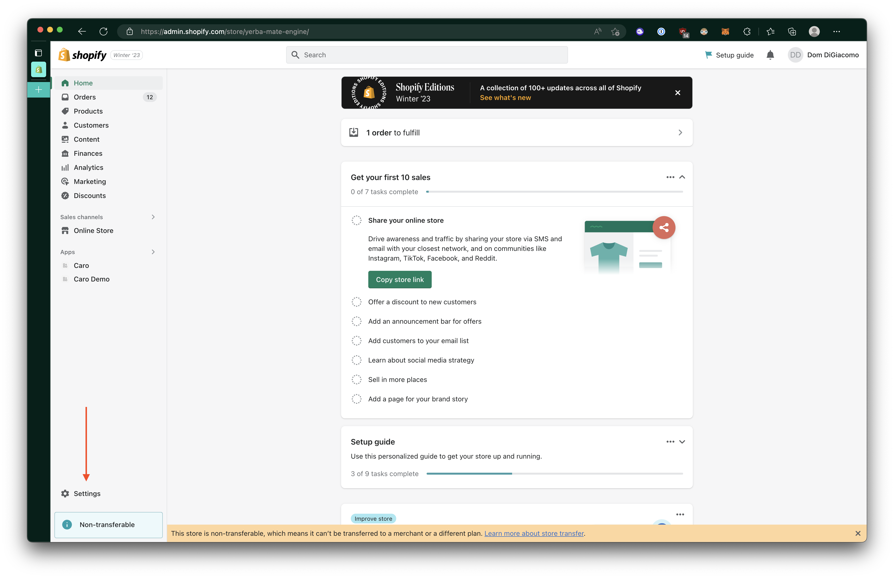

# Step 2) Open `Apps and sales channels`

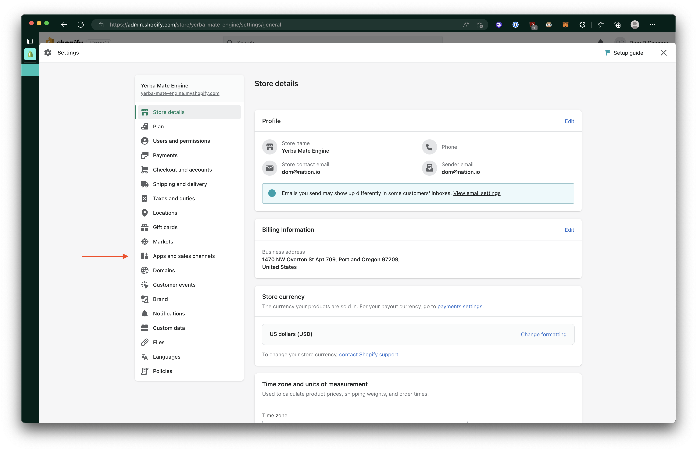

# Step 3) Open `Develop apps`

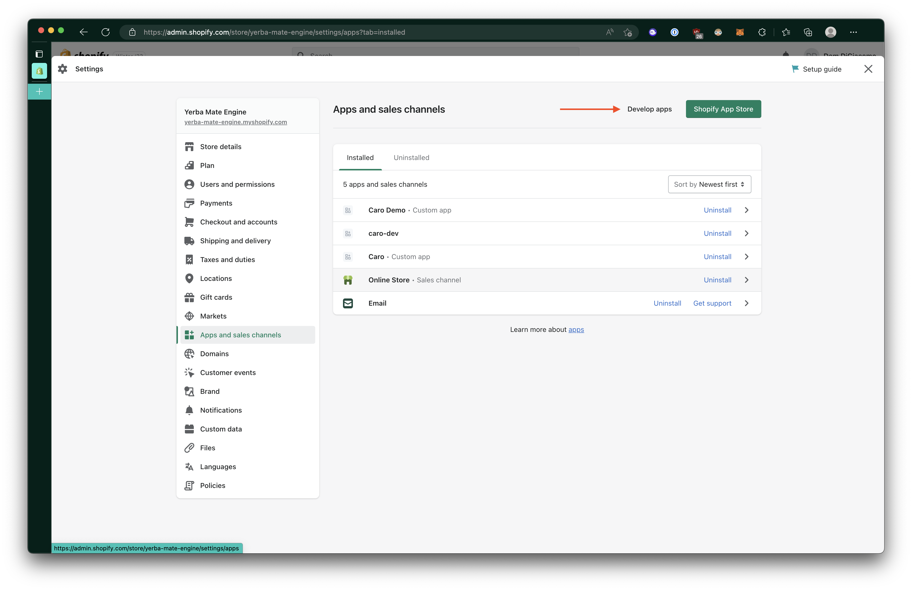

# Step 4) Open `Create an app`

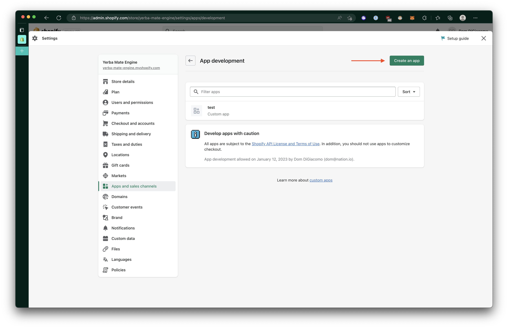

# Step 5) Create app

## Step 5a) Give unique name

## Step 5b) Confirm `Create app`

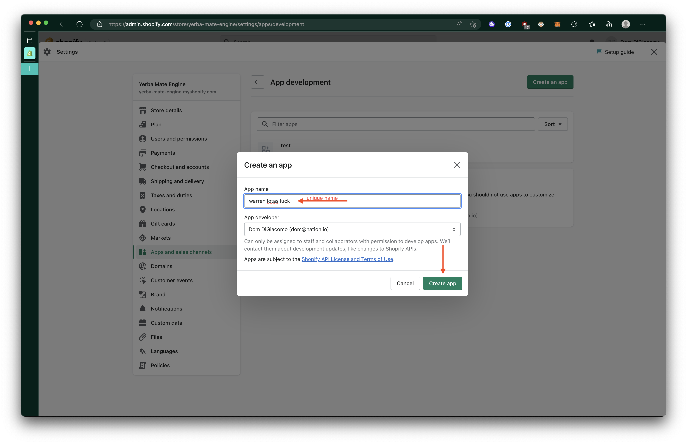

# Step 6) Open `Configure Storefront API scopes`

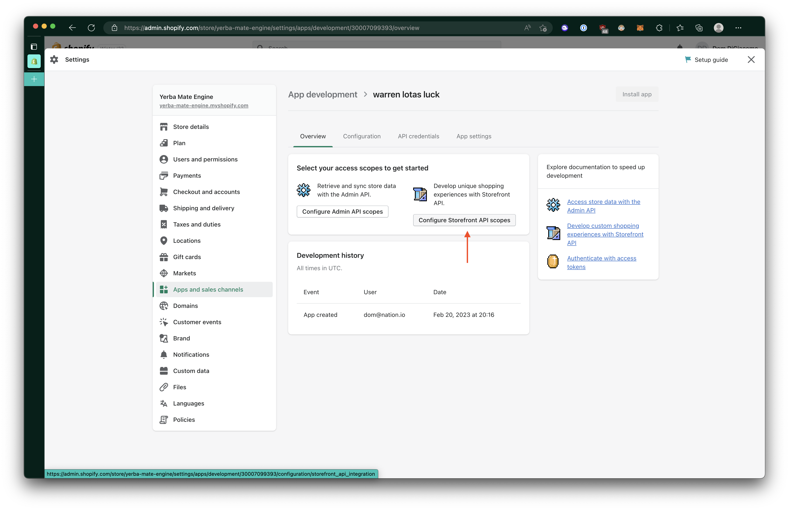

# Step 7) Configure Storefront API scopes

## Step 7a) Scroll down

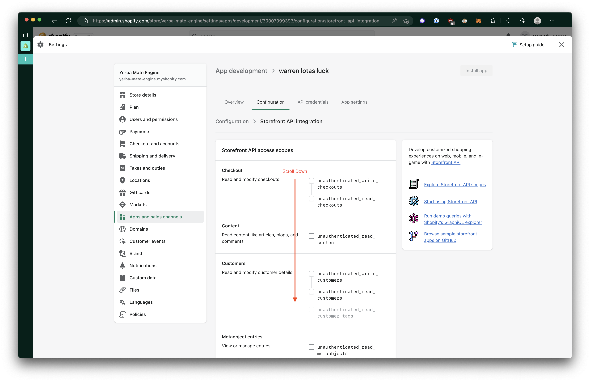

## Step 7b) Enable `unauthenticated_read_product_listings` and `unauthenticated_read_product_inventory`

## Step 7c) Confirm `Save`

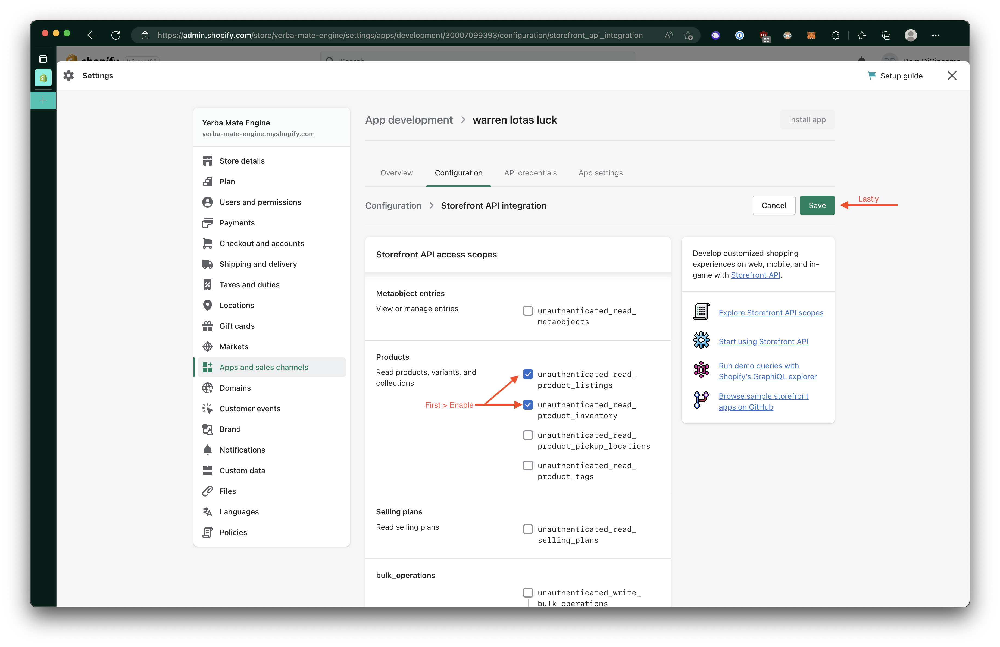

# Step 8) Click `Install app`

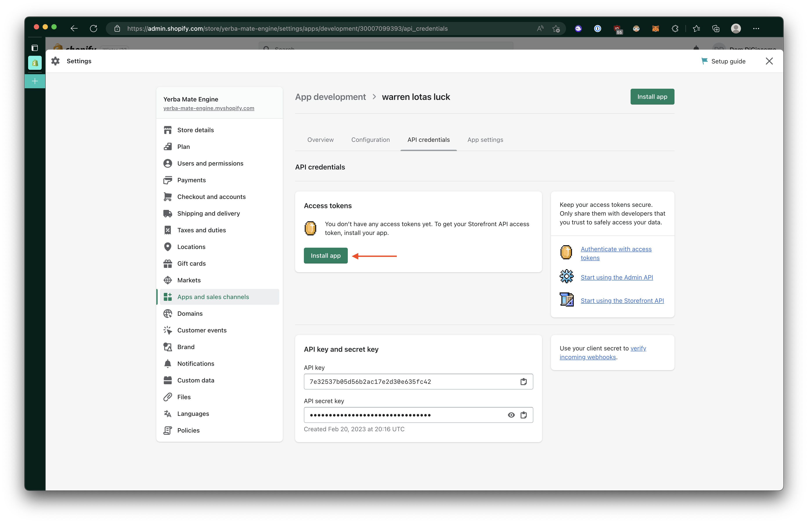

# Step 9) Confirm `Install`

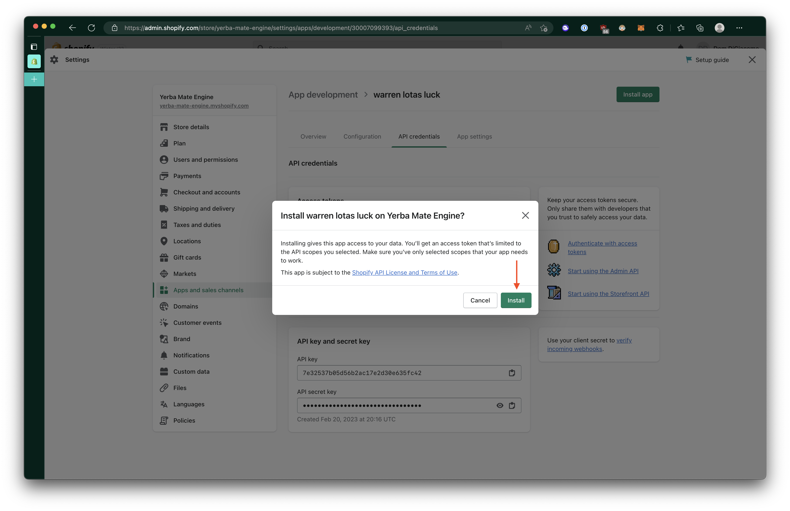

# Step 10) Copy and Share `Storefront API access token`

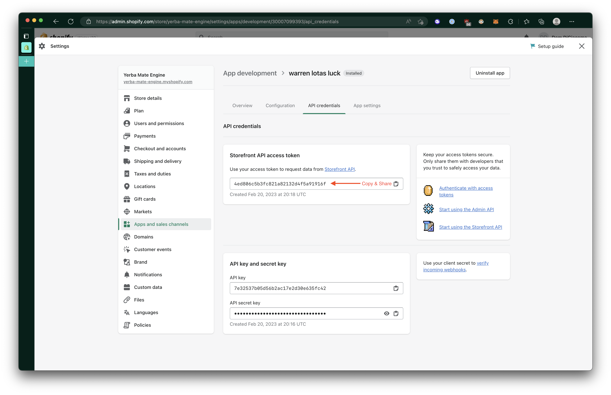
